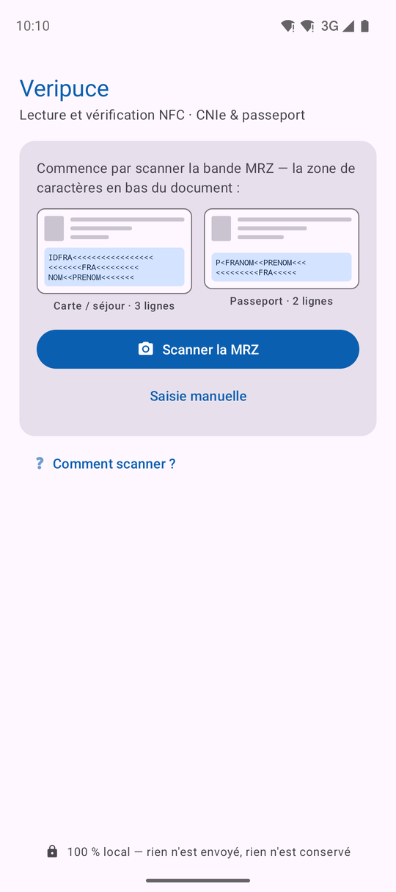
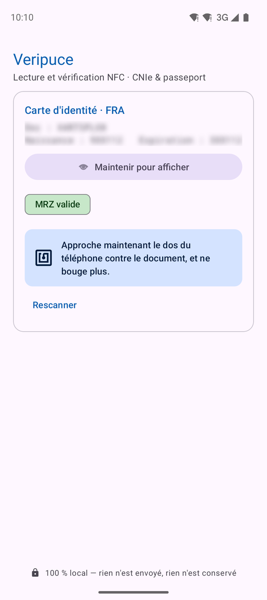

# Veripuce

**Lecture et vérification NFC de documents d'identité — CNIe française, passeports biométriques et titres de séjour (ICAO 9303).**

[](https://github.com/sanjuant/veripuce/actions/workflows/build-apk.yml)
[](https://github.com/sanjuant/veripuce/releases/latest)


Veripuce lit la puce NFC d'une **carte d'identité électronique**, d'un **passeport biométrique**
ou d'un **titre de séjour**, affiche l'état civil et la photo stockés dans la puce, et vérifie
**cryptographiquement** qu'il s'agit d'un document authentique émis par l'État. Le téléphone sert
de lecteur — aucun matériel externe, aucun réseau.

| Écran principal | Scan OCR (viseur) | Document détecté | Résultat vérifié |
|:---:|:---:|:---:|:---:|
|  |  |  |  |

*Captures d'écran avec des données fictives.*

## Ce que Veripuce vérifie

Quatre contrôles **indépendants**, affichés en clair sur l'écran de résultat :

| Vérification | Ce que ça prouve |
|---|---|
| **Intégrité** | Les données de la puce n'ont pas été altérées (empreintes signées du SOD). |
| **Émis par l'État** | La signature de la puce remonte à une autorité nationale de confiance (CSCA). |
| **Cohérence** | La MRZ imprimée correspond bien à la puce. |
| **Anti-clone** | La puce prouve qu'elle détient une clé privée non extractible (Chip/Active Authentication). |

Le tout **100 % sur l'appareil** : l'application n'a pas la permission Internet et n'écrit aucune
donnée. → [Sécurité & confidentialité](docs/securite-confidentialite.md).

## Utilisation

1. **Scanner la MRZ** — la bande de caractères en bas du document, à la caméra. Veripuce en
   déduit le type de document et valide les chiffres de contrôle ICAO.
2. **Approcher la puce** — la session s'ouvre avec la clé dérivée de la MRZ, **sans rien saisir**,
   y compris pour les cartes d'identité. Si une carte refuse cette clé, le champ **CAN** (6
   chiffres au recto) apparaît en repli.
3. **Lire le résultat** — identité, photo et les quatre vérifications.

**Saisie manuelle** (caméra indisponible ou MRZ illisible) : onglets *Carte / Passeport / Séjour*,
avec le CAN pour une carte ou le n° + dates pour les autres. Une **lampe torche** intégrée aide en
basse lumière.

### Mode diagnostic

Pour investiguer un cas où une carte bascule sur le CAN, un rapport technique **caviardé** (sans
aucune donnée personnelle) est disponible :

1. **Appui long sur le titre « Veripuce »** → « Mode diagnostic activé » (persistant).
2. Faire la lecture : une carte **« Détails techniques »** apparaît (résultat ou échec).
3. La déplier, puis **Copier** ou **Partager** le rapport.

> Activer le mode **avant** de reproduire le problème. Détail des règles de caviardage :
> [Sécurité & confidentialité](docs/securite-confidentialite.md#3-le-rapport-de-diagnostic-caviardé).

## Documentation détaillée

Pour comprendre *comment* ça marche, le dossier [**`docs/`**](docs/README.md) :

- [**Glossaire**](docs/glossaire.md) — tous les sigles (MRZ, CAN, DG, SOD, PACE, CSCA…) en français simple. *À lire en premier.*
- [**Architecture**](docs/architecture.md) — carte des fichiers, le « voyage d'une lecture » (schémas + pseudocode), machines à états.
- [**Algorithmes**](docs/algorithmes.md) — OCR de la MRZ, passive authentication, anti-clone.
- [**Calcul des clés d'accès**](docs/cles-acces.md) — dérivation MRZ/CAN, candidats sur paires aveugles, PACE/BAC.
- [**Sources & données**](docs/sources.md) — certificats CSCA (ICAO + BSI + ANTS), jeux de test.
- [**Sécurité & confidentialité**](docs/securite-confidentialite.md) — on-device, floutage, rapport caviardé, EAC.
- [**Dépannage**](docs/depannage.md) — lire le rapport de diagnostic, arbre de décision des échecs de lecture.

## Installation

**Depuis les releases** — télécharger le dernier APK signé :
**[Releases](https://github.com/sanjuant/veripuce/releases/latest)** (`veripuce-x.y.z.apk`).
Prérequis : Android 7.0+ (API 24) avec NFC ; caméra optionnelle.

**Compilation locale**
```bash
git clone https://github.com/sanjuant/veripuce.git
cd veripuce
./gradlew assembleDebug     # app/build/outputs/apk/debug/veripuce-debug.apk
```
Prérequis : JDK 17, Android SDK (compileSdk 36). Le wrapper Gradle est fourni.

Un push sur une branche produit un APK de debug (`build-apk.yml`) ; un tag `v*` produit une
**GitHub Release** avec APK signé (`release.yml`, clé injectée par secrets, jamais dans le dépôt).

## Stack technique

| Composant | Version | Rôle |
|---|---|---|
| [JMRTD](https://jmrtd.org/) | 0.8.6 | PACE/BAC, Secure Messaging, LDS, SOD |
| [SCUBA](https://scuba.sourceforge.net/) `scuba-sc-android` | 0.0.26 | Transport carte à puce sur Android |
| BouncyCastle `bcprov/bcpkix-jdk18on` | 1.84 | Cryptographie (brainpool, CMS, CMAC…) |
| ML Kit Text Recognition (*bundled*) | 16.0.1 | OCR on-device, hors-ligne |
| CameraX | 1.6.1 | Prévisualisation + analyse (scan OCR) |

Chaîne de build : **AGP 8.13.2 · Kotlin 2.3.21 · Gradle 8.14.3 · JDK 17 · compileSdk/targetSdk 36 · minSdk 24**.

<details>
<summary>Pièges connus</summary>

- **BouncyCastle vs BC d'Android** — au démarrage, le provider partiel d'Android est remplacé par
  la version complète (`Security.removeProvider("BC")` puis `addProvider`).
- **Empreintes sur octets bruts** — les DG sont hachés sur leurs octets *tels que lus*, jamais
  re-sérialisés (une re-sérialisation JMRTD diverge et invaliderait un document authentique).
  → [Algorithmes](docs/algorithmes.md#6-passive-authentication).
- **JPEG 2000** — la photo est décodée par JP2ForAndroid (miroir Maven du package Gemalto retiré).
- **`androidx.core` plafonné à 1.18** — les versions 1.19+ exigent l'API 37 / AGP 9.1.

</details>

## Conformité

> Lire une pièce d'identité traite des **données personnelles**. Recueillir le consentement de la
> personne, respecter la minimisation (RGPD) et n'utiliser l'application que dans un cadre
> légitime. Les garanties techniques (aucun réseau, aucune conservation) sont détaillées dans
> [Sécurité & confidentialité](docs/securite-confidentialite.md).

## Roadmap

- [x] Signature CSCA — origine étatique prouvée (magasin ICAO + BSI + ANTS, 773 certs)
- [x] Rafraîchissement hebdomadaire automatique du magasin CSCA (PR relue par un humain)
- [x] Fiabilisation PACE-MRZ des cartes d'identité (candidats sur paires aveugles, vote par position)
- [x] Rapport de diagnostic caviardé (mode diagnostic)
- [ ] Validation de l'anti-clone (Active Authentication RSA) sur documents réels
- [ ] Migration AGP 9.x / API 37 quand l'écosystème AndroidX l'exigera
