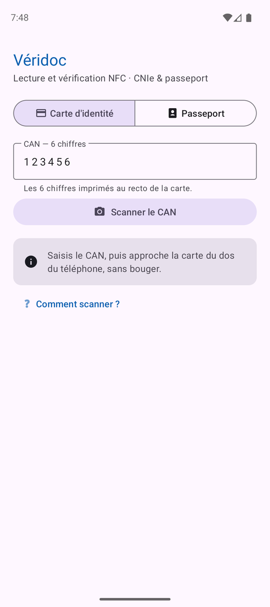
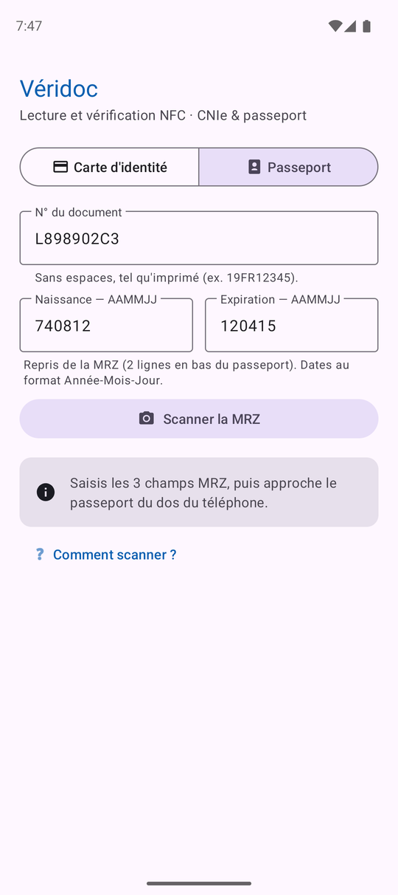
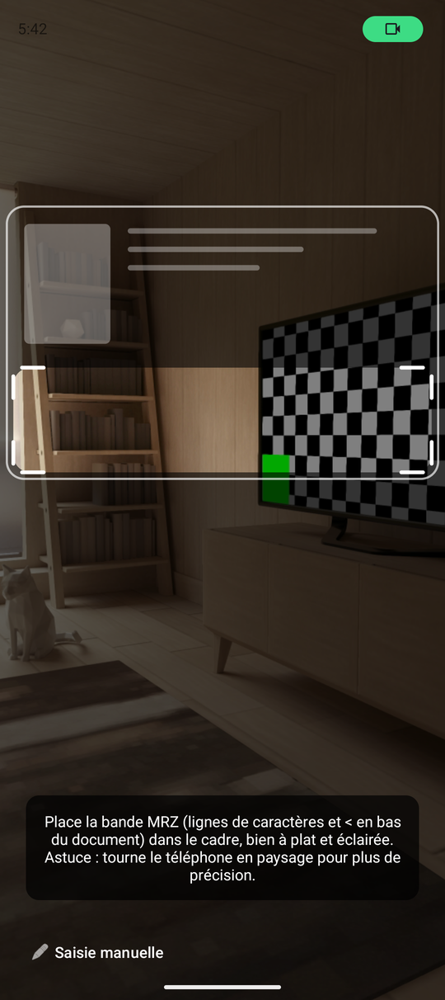
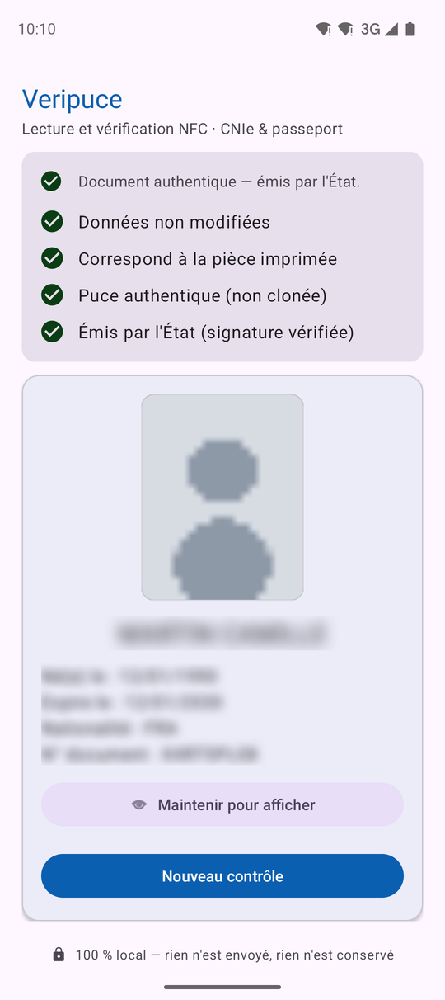

# Véridoc

**Lecture et vérification NFC de documents d'identité — CNIe française & passeports biométriques (ICAO 9303).**

[](https://github.com/sanjuant/veridoc/actions/workflows/build-apk.yml)
[](https://github.com/sanjuant/veridoc/releases/latest)


Véridoc lit la puce NFC d'une **carte nationale d'identité électronique** (format 2021) ou d'un
**passeport biométrique**, affiche l'état civil et la photo stockés dans la puce, et vérifie
**cryptographiquement** que les données n'ont pas été altérées (*passive authentication*).
Aucun matériel externe : le téléphone sert de lecteur.

| Mode carte d'identité | Mode passeport | Scan OCR (viseur) | Résultat de lecture |
|:---:|:---:|:---:|:---:|
|  |  |  |  |

*Captures d'écran avec des données fictives (spécimen ICAO 9303 et identité factice).*

## Fonctionnalités

- **Deux modes de lecture** — CNIe via **PACE-CAN** (les 6 chiffres du recto), passeport via
  **PACE-MRZ** avec repli **BAC** pour les documents anciens.
- **Scan OCR intégré** — le CAN ou la bande MRZ peuvent être scannés à la caméra
  (CameraX + ML Kit, **100 % hors-ligne, on-device**) ; la lecture MRZ n'est acceptée que si
  les **chiffres de contrôle ICAO** sont valides. La saisie manuelle reste toujours possible.
- **Vérification d'intégrité** — les empreintes des groupes de données lus (DG1, DG2, DG13)
  sont recalculées sur les **octets bruts de la puce** et comparées aux empreintes **signées**
  du SOD (Document Security Object).
- **Données France (DG13)** — adresse, taille et lieu de naissance, spécifiques à la CNIe,
  décodés par un parseur BER-TLV dédié (encodage Latin-1 géré).
- **Photo de la puce** — décodage JPEG 2000 (et JPEG/PNG), formats **ISO 19794** et
  **ISO 39794** (passeports récents).
- **Interface Material 3** — thème clair/sombre, icône adaptative + monochrome (Android 13+),
  affichage bord-à-bord (Android 15+).

## Comment ça marche

Un eMRTD (ICAO 9303) exige l'établissement d'un canal sécurisé avant toute lecture. Seule la
**clé d'accès** diffère selon le document ; la lecture est ensuite identique :

| Document | Ouverture de session | Clé d'accès |
|---|---|---|
| CNIe (France, 2021+) | PACE | **CAN** — 6 chiffres imprimés au recto |
| Passeport récent | PACE | Clé dérivée de la **MRZ** (n° document + naissance + expiration) |
| Passeport ancien | BAC | Clé dérivée de la **MRZ** |

```
IsoDep (NFC) ──► CardService (SCUBA) ──► PassportService (JMRTD)
                       │
                       ├── PACE-CAN / PACE-MRZ / BAC          (session sécurisée)
                       ├── DG1 (MRZ) · DG2 (photo) · DG13 (France)
                       └── EF.SOD ──► vérification des empreintes signées
```

### Modèle de sécurité

La *passive authentication* (ICAO 9303 partie 11) comporte trois étapes :

| # | Étape | Ce que ça prouve | Statut |
|---|---|---|---|
| 1 | Lecture de l'**EF.SOD** | — | ✅ |
| 2 | Empreintes recalculées = empreintes **signées** du SOD | Données **non altérées** | ✅ |
| 3 | Signature du SOD chaînée jusqu'à une **CSCA de confiance** (ANTS / ICAO PKD) | Document **émis par l'État** | 🚧 roadmap |

En complément, la *Chip Authentication* (détection de puce **clonée**) est envisagée en roadmap.
Les chips d'état de l'interface reflètent honnêtement cette couverture : « Intégrité OK » et
« Signature non vérifiée » tant que le magasin CSCA n'est pas embarqué.

### Limites structurelles

- **DG3 (empreintes digitales) et DG4 (iris)** sont protégés par l'EAC, qui exige un certificat
  de terminal délivré par l'État. Ils sont **inaccessibles** à toute application tierce, par
  conception (la puce répond `6982`).
- La position de l'antenne NFC varie selon les téléphones : la lecture demande un placement
  stable du document quelques secondes.

## Installation

### Depuis les releases

Télécharger le dernier APK signé : **[Releases](https://github.com/sanjuant/veridoc/releases/latest)**
(`veridoc-x.y.z.apk`), puis l'installer (autoriser les sources inconnues si nécessaire).

Prérequis : Android 7.0+ (API 24) avec NFC. La caméra est optionnelle (scan OCR).

### Compilation locale

```bash
git clone https://github.com/sanjuant/veridoc.git
cd veridoc
./gradlew assembleDebug          # APK : app/build/outputs/apk/debug/veridoc-debug.apk
```

Prérequis : JDK 17, Android SDK (compileSdk 36). Le wrapper Gradle est fourni (8.14.3 épinglé).

### Intégration continue

| Déclencheur | Workflow | Sortie |
|---|---|---|
| push sur une branche | `build-apk.yml` | artefact **veridoc-debug-apk** |
| tag `v*` (ex. `v1.0.0`) | `release.yml` | **GitHub Release** avec APK **signé** `veridoc-x.y.z.apk` |

La clé de signature n'est jamais dans le dépôt : elle est injectée par secrets GitHub
(`KEYSTORE_BASE64`, `KEYSTORE_PASSWORD`, `KEY_ALIAS`, `KEY_PASSWORD`). Le `versionCode` est
dérivé du tag (déterministe et monotone), et la signature de l'APK est vérifiée par `apksigner`
avant publication.

## Stack technique

| Composant | Version | Rôle |
|---|---|---|
| [JMRTD](https://jmrtd.org/) | 0.8.6 | PACE/BAC, Secure Messaging, LDS, SOD |
| [SCUBA](https://scuba.sourceforge.net/) (`scuba-sc-android`) | 0.0.26 | Transport carte à puce sur Android |
| BouncyCastle (`bcprov-jdk18on`) | 1.84 | Cryptographie (Brainpool, CMAC…) |
| JP2ForAndroid (miroir `io.github.CshtZrgk:jp2-android`) | 1.0.0 | Décodage JPEG 2000 |
| CameraX | 1.6.1 | Prévisualisation + analyse d'images (scan OCR) |
| ML Kit Text Recognition (bundled) | 16.0.1 | OCR on-device, hors-ligne |
| AndroidX / Material Components | core 1.18 · appcompat 1.7.1 · lifecycle 2.11 · material 1.14 | UI |

Chaîne de build : **AGP 8.13.2 · Kotlin 2.3.21 · Gradle 8.14.3 · JDK 17 · compileSdk/targetSdk 36 · minSdk 24**.

<details>
<summary>Notes techniques (pièges connus)</summary>

- **BouncyCastle vs BC embarqué d'Android** — Android embarque une version partielle de BC.
  Au démarrage, l'app remplace le provider : `Security.removeProvider("BC")` puis
  `Security.addProvider(BouncyCastleProvider())`.
- **Passive authentication sur octets bruts** — les empreintes du SOD sont calculées par
  l'émetteur sur les octets *tels que stockés* ; hacher une re-sérialisation JMRTD
  (`DGxFile.encoded`) peut diverger octet à octet et invalider un document authentique.
  Véridoc lit chaque DG une fois en brut et parse depuis ces mêmes octets.
- **Pas de `javax.imageio` sur Android** — la photo (souvent JPEG 2000) est décodée par
  JP2ForAndroid ; la coordonnée d'origine `com.gemalto.jp2:jp2-android` n'étant plus
  résolvable, le projet utilise son miroir Maven Central (même package, mêmes libs natives).
- **DG13 en Latin-1** — les champs texte de la CNIe sont encodés ISO-8859-1 avec `<` comme
  séparateur et NUL comme remplissage.
- **`androidx.core` plafonné à 1.18** — les versions 1.19+ exigent l'API 37 et AGP 9.1 ;
  la migration AGP 9 (Kotlin intégré, Gradle 9.1+) est prévue quand l'écosystème l'imposera.

</details>

## Structure du projet

```
app/src/main/
├── AndroidManifest.xml
├── java/fr/veridoc/app/
│   ├── MainActivity.kt      # UI, sélecteur de mode, dispatch NFC, lancement lecture
│   ├── ScanActivity.kt      # scan OCR (CameraX + ML Kit, on-device)
│   ├── MrzOcr.kt            # parseur MRZ TD1/TD2/TD3 + CAN, chiffres de contrôle ICAO
│   ├── AccessKey.kt         # clé d'accès : Can (CNIe) / Mrz (passeport)
│   ├── CnieReader.kt        # PACE/BAC, lecture DG1/DG2/DG13, passive authentication
│   ├── ReadResult.kt        # résultat structuré
│   └── BerTlv.kt, Dg13*.kt  # parseur BER-TLV + DG13 (spécifique France)
└── res/                     # Material 3 : layouts, thèmes clair/sombre, icônes adaptatives
```

## Confidentialité

Véridoc est conçu **local-first**, et cette garantie est **vérifiable techniquement** :

- **Aucune permission Internet.** Les permissions `INTERNET` et `ACCESS_NETWORK_STATE`
  (injectées par les bibliothèques ML Kit/GMS) sont explicitement **retirées** du manifeste
  (`tools:node="remove"`) : l'application est *incapable* de transmettre une donnée.
  Vérifiable sur l'APK : `aapt2 dump permissions veridoc.apk` → NFC et CAMERA uniquement.
- **Aucun stockage.** Les données lues (état civil, photo, adresse) ne sont écrites nulle
  part — ni fichier, ni base, ni préférences ; `allowBackup=false`. Tout reste en mémoire
  et disparaît à la fermeture.
- **OCR hors-ligne.** Le modèle ML Kit est embarqué dans l'APK (mode *bundled*) : les images
  de la caméra sont analysées en mémoire sur l'appareil et jamais enregistrées.

Un bandeau « 100 % local » dans l'application ouvre le détail de ces garanties.

## Conformité et cadre d'usage

> **Important** — lire une pièce d'identité traite des **données personnelles** (dont la photo).
>
> - **RGPD** : consentement de la personne concernée, minimisation, aucune conservation —
>   voir les garanties techniques de la section Confidentialité.
> - La vérification d'**origine étatique** (étape 3, chaîne CSCA) n'est pas encore active :
>   l'app prouve aujourd'hui l'intégrité interne du document, pas son émission par l'État.

## Roadmap

- [ ] **Passive authentication complète** : vérification de la signature du SOD et chaîne
      DSC → CSCA (magasin ANTS / ICAO PKD embarqué)
- [ ] **Chip Authentication** (détection de clone)
- [ ] Migration AGP 9.x / API 37 quand l'écosystème AndroidX l'exigera
- [x] Scan OCR du CAN et de la MRZ (on-device)
- [x] Support passeport (PACE-MRZ / BAC) et CNIe (PACE-CAN)
- [x] Release signée automatisée (tag → GitHub Release)
